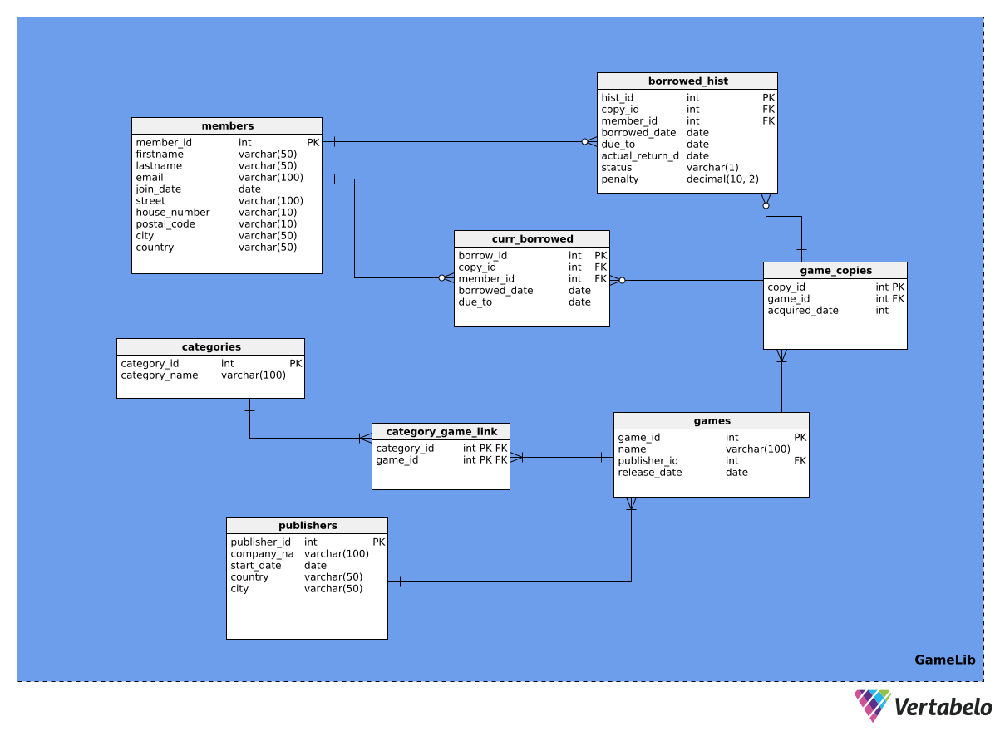

# GameLib
**Autorzy:**  
- Łukasz Krementowski  
- Mateusz Ryś
## Temat projektu: Wypożyczalnia gier


**Technologie użyte w projekcie:**
- PostgreSQL
- Hibernate
- Java 21
- JavaFX

## 1. Lista funkcji aplikacji

Poniżej znajduje się lista głównych funkcji zaimplementowanych w projekcie **GameLib** wraz z krótkim opisem każdej z nich:

- **Przeglądanie dostępnych gier**  
  Umożliwia użytkownikowi przeglądanie pełnej listy gier dostępnych w wypożyczalni wraz z podstawowymi informacjami o każdej z nich (tytuł, wydawca, kategorie).

- **Podgląd wypożyczonych gier**  
  Pozwala użytkownikowi sprawdzić, które gry są aktualnie wypożyczone i do kiedy powinnien nastąpić ich zwrot.

- **Dodanie rezerwacji**  
  Użytkownik może zarezerwować wybraną grę, jeśli jest dostępna jej kopia. 

- **Oddanie gry**  
  Funkcja umożliwia zwrot wypożyczonej gry do wypożyczalni. Po oddaniu kopii gry, staje się ona ponownie dostępna dla innych użytkowników.

- **Sprawdzenie historii wypożyczeń**  
  Użytkownik ma dostęp do historii wszystkich swoich wypożyczeń, wraz z datami wypożyczenia i zwrotu oraz ewentualnymi karami.

- **Sortowanie i filtrowanie (widok)**  
  Pozwala na sortowanie i filtrowanie listy gier według różnych kryteriów, takich jak tytuł, kategoria, dostępność czy wydawca.

- **Suma kar oraz logowanie**  
  System umożliwia użytkownikowi zalogowanie się oraz sprawdzenie sumy naliczonych kar za nieterminowe zwroty.


## 2. Schemat i opis bazy



Poniżej znajduje się opis głównych tabel wykorzystanych w projekcie **GameLib**:

### members
Tabela przechowuje informacje o użytkownikach systemu.
- **member_id** – klucz główny, unikalny identyfikator użytkownika (autoinkrementacja)
- **first_name** – imię użytkownika
- **last_name** – nazwisko użytkownika
- **email** – adres e-mail (unikalny)
- **join_date** – data dołączenia do systemu (domyślnie bieżąca data)
- **street, house_number, postal_code, city, country** – dane adresowe użytkownika

### categories
Tabela przechowuje kategorie gier.
- **category_id** – klucz główny, unikalny identyfikator kategorii (autoinkrementacja)
- **category_name** – nazwa kategorii (unikalna)

### publishers
Tabela przechowuje wydawców gier.
- **publisher_id** – klucz główny, unikalny identyfikator wydawcy (autoinkrementacja)
- **company_name** – nazwa firmy wydawcy (unikalna)
- **city** – miasto siedziby wydawcy

### games
Tabela przechowuje informacje o grach.
- **game_id** – klucz główny, unikalny identyfikator gry (autoinkrementacja)
- **publisher_id** – klucz obcy do tabeli publishers

### game_copies
Tabela przechowuje informacje o poszczególnych kopiach gier dostępnych w wypożyczalni.
- **copy_id** – klucz główny, unikalny identyfikator kopii gry (autoinkrementacja)
- **game_id** – klucz obcy do tabeli games

### curr_borrowed
Tabela przechowuje informacje o aktualnie wypożyczonych grach.
- **borrow_id** – klucz główny, unikalny identyfikator wypożyczenia (autoinkrementacja)
- **member_id** – klucz obcy do tabeli members
- **copy_id** – klucz obcy do tabeli game_copies

### borrowed_hist
Tabela przechowuje historię wszystkich wypożyczeń.
- **hist_id** – klucz główny, unikalny identyfikator rekordu historii (autoinkrementacja)
- **member_id** – klucz obcy do tabeli members
- **copy_id** – klucz obcy do tabeli game_copies

### category_game_link
Tabela łącząca gry z kategoriami (relacja wiele-do-wielu).
- **category_id** – klucz obcy do tabeli categories
- **game_id** – klucz obcy do tabeli games

Każda z powyższych tabel posiada odpowiednie klucze główne i obce, zapewniające spójność danych oraz relacje pomiędzy encjami w systemie.

### Widoki

#### game_count_vw

Widok `game_count_vw` prezentuje listę wszystkich gier dostępnych w wypożyczalni wraz z liczbą dostępnych (niewypożyczonych) kopii każdej gry.  

**Kolumny widoku:**
- `game_id` – identyfikator gry
- `name` – nazwa gry
- `amount` – liczba dostępnych kopii (czyli tych, które nie są obecnie wypożyczone)

## 3. Encje Hibernate (Entities)

Każda encja w folderze `Maven\GameLib\src\main\java\Entities` odpowiada jednej tabeli w bazie danych i jest mapowana za pomocą adnotacji JPA/Hibernate. Poniżej opisano każdą encję, jej powiązanie z tabelą oraz główne funkcje i pola:

### Member (`members`)
- **Mapowanie:** Tabela `members`
- **Pola:** `memberId`, `firstName`, `lastName`, `email`, `joinDate`, `street`, `houseNumber`, `postalCode`, `city`, `country`
- **Opis:** Przechowuje dane użytkowników systemu.
```java
@Entity
@Table(name = "members")
public class Member {
    @Id
    @GeneratedValue(strategy = GenerationType.IDENTITY)
    @Column(name = "member_id", nullable = false, unique = true)
    private int id;

    @Column(name = "first_name", length = 50)
    private String firstName;

    @Column(name = "last_name", length = 50)
    private String lastName;

    @Column(name = "email", length = 100)
    private String email;

    @Column(name="join_date")
    private LocalDate joinDate;

    @Column(name = "street", length = 100)
    private String street;

    @Column(name = "house_number", length = 10)
    private String houseNumber;

    @Column(name = "postal_code", length = 10)
    private String postalCode;

    @Column(name = "city", length = 50)
    private String city;

    @Column(name = "country", length = 50)
    private String country;

    public Member() {}

    //Gettery i Settery
```

### Category (`categories`)
- **Mapowanie:** Tabela `categories`
- **Pola:** `categoryId`, `categoryName`
- **Opis:** Reprezentuje kategorię gry. Pozwala na grupowanie gier według typu.
```java
@Entity
@Table(name = "categories")
public class Category {
    @Id
    @GeneratedValue(strategy = GenerationType.IDENTITY)
    @Column(name = "category_id", nullable = false)
    private int id;

    @Column(name = "category_name", length = 100, unique = true, nullable = false)
    private String categoryName;

    public Category() {}

    //Gettery i Settery
}
```
### Publisher (`publishers`)
- **Mapowanie:** Tabela `publishers`
- **Pola:** `publisherId`, `companyName`, `city`
- **Opis:** Przechowuje dane wydawców gier. Pozwala powiązać gry z konkretnym wydawcą.
```java
@Entity
@Table(name = "publishers")
public class Publisher {
    @Id
    @GeneratedValue(strategy = GenerationType.IDENTITY)
    @Column(name = "publisher_id", nullable = false, unique = true)
    private int id;

    @Column(name = "company_name", length = 100, nullable = false, unique = true)
    private String companyName;

    @Column(name = "start_date")
    private LocalDate startDate;

    @Column(name = "country", length = 50)
    private String country;

    @Column(name = "city", length = 50)
    private String city;

    public Publisher() {}

    //Gettery i Settery
}
```

### Game (`games`)
- **Mapowanie:** Tabela `games`
- **Pola:** `gameId`, `name`, `publisher`, `releaseDate`
- **Opis:** Przechowuje informacje o grach, takie jak tytuł, wydawca i data wydania. 
```java
@Entity
@Table(name = "games")
public class Game {
    @Id
    @GeneratedValue(strategy = GenerationType.IDENTITY)
    @Column(name = "game_id", unique = true)
    private int id;

    @Column(name = "name", length = 100)
    private String name;

    @ManyToOne
    @JoinColumn(name = "publisher_id", nullable = false)
    private Publisher publisher;


    @Column(name = "release_date")
    private LocalDate releaseDate;

    public Game() {}

    //Gettery i Settery
}
```
### GameCopy (`game_copies`)
- **Mapowanie:** Tabela `game_copies`
- **Pola:** `copyId`, `game`
- **Opis:** Reprezentuje pojedynczą kopię gry dostępną w wypożyczalni. Umożliwia śledzenie dostępności egzemplarzy.
```java
@Entity
@Table(name = "game_copies")
public class GameCopy {
    @Id
    @GeneratedValue(strategy = GenerationType.IDENTITY)
    @Column(name = "copy_id", nullable = false)
    private int id;

    @ManyToOne
    @JoinColumn(name = "game_id", nullable = false)
    private Game game;

    @Column(name = "acquired_date")
    private LocalDate acquiredDay;

    public GameCopy() {}

    //Gettery i Settery
}
```
### CurrBorrowed (`curr_borrowed`)
- **Mapowanie:** Tabela `curr_borrowed`
- **Pola:** `borrowId`, `member`, `copy`, `borrowedDate`, `dueTo`
- **Opis:** Przechowuje informacje o aktualnie wypożyczonych grach, w tym kto i kiedy wypożyczył daną kopię oraz do kiedy powinna zostać zwrócona.
```java
@Entity
@Table(name = "curr_borrowed")
public class CurrBorrowed {
    @Id
    @GeneratedValue(strategy = GenerationType.IDENTITY)
    @Column(name = "borrow_id", nullable = false, unique = true)
    private int id;

    @OneToOne
    @JoinColumn(name = "copy_id", nullable = false)
    private GameCopy gameCopy;

    @ManyToOne
    @JoinColumn(name = "member_id", nullable = false)
    private Member member;

    @Column(name = "borrowed_date")
    private LocalDate borrowedDate;

    @Column(name = "due_to")
    private LocalDate dueTo;

    public CurrBorrowed() {}

    //Gettery i Settery
}
```
### BorrowedHist (`borrowed_hist`)
- **Mapowanie:** Tabela `borrowed_hist`
- **Pola:** `histId`, `member`, `copy`, `borrowedDate`, `dueTo`, `actualReturnDate`, `status`, `penalty`
- **Opis:** Przechowuje historię wszystkich wypożyczeń, w tym daty zwrotów i ewentualne kary za przetrzymanie gry.
```java
@Entity
@Table(name = "borrowed_hist")
public class BorrowedHist {
    @Id
    @GeneratedValue(strategy = GenerationType.IDENTITY)
    @Column(name = "hist_id", nullable = false, unique = true)
    private int id;

    @ManyToOne
    @JoinColumn(name = "copy_id", nullable = false)
    private GameCopy gameCopy;

    @ManyToOne
    @JoinColumn(name = "member_id", nullable = false)
    private Member member;

    @Column(name = "borrowed_date")
    private LocalDate borrowedDate;

    @Column(name = "due_to")
    private LocalDate dueDate;

    @Column(name = "actual_return_date")
    private LocalDate actualReturnDate;

    @Column(name = "status", length = 1)
    private String status;

    @Column(name = "penalty")
    private double penalty;

    public BorrowedHist() {}

    //Gettery i Settery
}
```
### CategoryGameLink (`category_game_link`)
- **Mapowanie:** Tabela `category_game_link`
- **Pola:** `category`, `game`
- **Opis:** Realizuje relację wiele-do-wielu między grami a kategoriami. Pozwala przypisać grę do wielu kategorii i odwrotnie.
```java
@Embeddable
public class CategoryGameLinkId implements Serializable {
    private Integer categoryId;
    private Integer gameId;

    public CategoryGameLinkId() {}

    public CategoryGameLinkId(Integer categoryId, Integer gameId) {
        this.categoryId = categoryId;
        this.gameId = gameId;
    }

    //Gettery i Settery
}
```
---

Każda encja posiada odpowiednie adnotacje JPA, relacje oraz metody umożliwiające wygodne zarządzanie danymi w aplikacji.

## 4. Warstwa dostępu do danych (DAO)

W folderze ``Maven\GameLib\src\main\java\dao` znajdują się klasy typu **Data Access Object (DAO)**, które odpowiadają za komunikację aplikacji z bazą danych. DAO oddzielają logikę biznesową od operacji na bazie, zapewniając czytelność i łatwość utrzymania kodu.

### Główne zadania DAO:
- Tworzenie, odczytywanie i usuwanie rekordów w bazie (operacje CRUD)
- Realizacja zapytań do bazy z użyciem JPA/Hibernate
- Obsługa wyjątków związanych z bazą danych

### Przykładowe klasy DAO:

#### MemberDAO
- Odpowiada za operacje na encji `Member` (tabela `members`)
- Przykładowe metody: zalogowanie użytkownika
```java
public class MemberDAO {
    private static MemberDAO instance = null;

    private MemberDAO() {}

    public static MemberDAO getInstance(){
        if(instance == null){
            instance = new MemberDAO();
        }
        return instance;
    }

    public Member getMember(int id, Session session) {
            return session
                    .createQuery("select m from Member m where m.id=:id",Member.class)
                    .setParameter("id",id)
                    .getSingleResult();
    }

    public Integer logIn(String email, Session session) {
        Member member = session
                .createQuery("select m from Member m where m.email=:email",Member.class)
                .setParameter("email",email)
                .getSingleResult();

        return member == null ? null : member.getId();
    }
}
```
#### GameDAO
- Odpowiada za operacje na encji `Game` (tabela `games`)
- Przykładowe metody: pobieranie gier po kategorii, wyszukiwanie po tytule, lista dostępnych gier
```java
public class GameDAO {
    private static GameDAO instance = null;

    private GameDAO() {}

    public static GameDAO getInstance(){
        if(instance == null){
            instance = new GameDAO();
        }
        return instance;
    }

    private List<String> getAllCategories(Game game, Session session) throws IllegalArgumentException{
        if(game == null){
            throw new IllegalArgumentException("Game is null");
        }
        return session
        .createQuery(
          "select cgl.category.categoryName from CategoryGameLink cgl where cgl.game.id = :gameId")
                .setParameter("gameId",game.getId())
                .list();
    }

    public Game findGameByName(String name, Session session) {
        return session
        .createQuery(
          "select g from Game g where g.name=:name",
          Game.class)
                .setParameter("name",name)
                .getSingleResult();
    }

    public List<Game> findAllAvailableGames(GameFilter gameFilter, Session session){
            List<Integer> gamesId =  session.
            createQuery(
                    "select c.id from GameCountVW c where c.amount > 0",Integer.class
            ).list();

            List<Game> games = new ArrayList<>();

            for (Integer id: gamesId) {
                Game game = session.get(Game.class,id);
                if (game == null) {
                    continue;
                }
                if (gameFilter.getName() != null 
                && !gameFilter.compareName(game.getName())) { 
                    continue;
                }
                if (gameFilter.getPublisherName() != null 
                && !gameFilter.comparePublisher(game.getPublisher().getCompanyName())) { 
                    continue;
                }
                if (gameFilter.getCategoryName() != null 
                && !gameFilter.compareCategory(getAllCategories(game,session))) {
                    continue;
                }
                games.add(game);
            }
            return games;
    }
}
```
#### BorrowedHistDAO
- Odpowiada za operacje na encji `BorrowedHist` (tabela `borrowed_hist`)
- Przykładowe metody: pobieranie historii wypożyczeń użytkownika, dodawanie nowego wpisu do historii
```java
public class BorrowedHistDAO {
    private static BorrowedHistDAO instance = null;

    private BorrowedHistDAO() {}

    public static BorrowedHistDAO getInstance(){
        if(instance == null){
            instance = new BorrowedHistDAO();
        }
        return instance;
    }

    public void addBorrowedHistoryRecord(int currBorrowedId, int penalty, Session session) throws IllegalArgumentException{
        CurrBorrowed currBorrowed = session.get(CurrBorrowed.class, currBorrowedId);

        if(currBorrowed == null){
            throw new IllegalArgumentException("Cannot find row in curr_borrowed table corresponding to provided ID");
        }

        GameCopy gameCopy = currBorrowed.getGameCopy();
        Member member =  currBorrowed.getMember();

        if(gameCopy == null || member == null){
            throw new IllegalArgumentException("Cannot find member or game copy with provided ID's");
        }

        BorrowedHist record = new BorrowedHist();

        record.setCopyId(gameCopy);
        record.setMemberId(member);
        record.setBorrowedDate(currBorrowed.getBorrowedDate());
        record.setDueDate(currBorrowed.getDueTo());
        record.setActualReturnDate(LocalDate.now());
        record.setPenalty(penalty);
        record.setStatus("R");

        session.persist(record);
    }

    public List<BorrowedHist> checkBorrowedHistForMember(Member member, Session session) throws IllegalArgumentException{
        List <BorrowedHist> result;

        if(member == null){
            throw new IllegalArgumentException("Provided member cannot be null");
        }
        int memberId = member.getId();
        String hql = "FROM BorrowedHist bc WHERE bc.member.id = :memberId";
        result = session.createQuery(hql, BorrowedHist.class)
                .setParameter("memberId", memberId)
                .getResultList();

        return result;
    }


    public void printAllRecords(Session session) throws IllegalArgumentException{
        Query<BorrowedHist> query = session.createQuery("FROM BorrowedHist", BorrowedHist.class);
        List<BorrowedHist> borrowedHists = query.getResultList();

        for (BorrowedHist borrowedRecord : borrowedHists) {
            System.out.println(borrowedRecord);
        }
    }

    public double SumOfPenalties(int id, Session session) throws IllegalArgumentException{
        Double sumPen = (Double) session
                .createQuery(
                  "select sum(h.penalty) from BorrowedHist h where h.member.id = :id"
                  )
                .setParameter("id", id)
                .getSingleResult();
        return sumPen != null ? sumPen : 0.0;
    }
}
```
#### CurrBorrowedDAO
- Odpowiada za operacje na encji `CurrBorrowed` (tabela `curr_borrowed`)
- Przykładowe metody: wypożyczanie gry, zwracanie gry, sprawdzanie aktualnych wypożyczeń
```java
public class CurrBorrowedDAO {
    private static CurrBorrowedDAO instance = null;

    private CurrBorrowedDAO() {}

    public static CurrBorrowedDAO getInstance(){
        if(instance == null){
            instance = new CurrBorrowedDAO();
        }
        return instance;
    }

    public void addBorrowedRecord(
      int gameId, 
      int memberId, 
      LocalDate borrowedDate, 
      LocalDate dueTo, 
      Session session) throws IllegalArgumentException{
        String hql = "FROM GameCopy gc WHERE gc.game.id = :gameId AND gc.id NOT IN " +
                "(SELECT cb.gameCopy.id FROM CurrBorrowed cb)";
        List<GameCopy> availableCopies = session
        .createQuery(hql, GameCopy.class)
                .setParameter("gameId", gameId)
                .setLockMode(LockMode.PESSIMISTIC_WRITE.toJpaLockMode())
                .getResultList();

        if (availableCopies.isEmpty()) {
            throw new IllegalArgumentException("No available copies for the specified game.");
        }

        Member member = session.get(Member.class, memberId);
        if (member == null) {
            throw new IllegalArgumentException("Invalid memberId provided.");
        }

        GameCopy gameCopy = availableCopies.getFirst();

        CurrBorrowed currBorrowed = new CurrBorrowed();
        currBorrowed.setGameCopy(gameCopy);
        currBorrowed.setMember(member);
        currBorrowed.setBorrowedDate(borrowedDate);
        currBorrowed.setDueTo(dueTo);

        session.persist(currBorrowed);

    }

    public void removeBorrowedRecord(int borrowedId, Session session) throws IllegalArgumentException{
        CurrBorrowed currBorrowed = session.get(CurrBorrowed.class, borrowedId);
        if (currBorrowed == null) {
            throw new IllegalArgumentException("No borrowed record found with the given ID.");
        }

        session.remove(currBorrowed);
    }

    public List<CurrBorrowed> checkBorrowedForMember(Member member, Session session) throws IllegalArgumentException{
        List <CurrBorrowed> result;

        if(member == null){
            throw new IllegalArgumentException("Provided member cannot be null");
        }
        int memberId = member.getId();
        String hql = "FROM CurrBorrowed cb WHERE cb.member.id = :memberId";
        result = session.createQuery(hql, CurrBorrowed.class)
                .setParameter("memberId", memberId)
                .getResultList();

        return result;
    }

    public void printAllRecords(Session session){
        Query<CurrBorrowed> query = session
        .createQuery("FROM CurrBorrowed", CurrBorrowed.class);

        List<CurrBorrowed> borrowed_curr = query.getResultList();

        for (CurrBorrowed borrowed : borrowed_curr) {
            System.out.println(borrowed);
        }
    }
}
```
---

DAO są kluczowym elementem architektury aplikacji, zapewniającym wydajny i bezpieczny dostęp do danych.

## 5. Pliki w folderze `sql`

W folderze `sql` znajdują się skrypty SQL służące do zarządzania strukturą i danymi bazy projektu **GameLib**. Każdy plik pełni określoną funkcję:

### Data.sql
Zawiera polecenia `INSERT`, które wstawiają przykładowe, testowe dane do wszystkich głównych tabel bazy. Umożliwia szybkie przygotowanie środowiska do testów i prezentacji działania aplikacji.

### DropTables.sql
Zawiera polecenia `DROP TABLE`, które usuwają wszystkie tabele z bazy danych. Skrypt ten pozwala na szybkie wyczyszczenie struktury bazy przed ponownym utworzeniem tabel.

### Flush.sql
Zawiera polecenia `TRUNCATE`, które usuwają wszystkie dane z tabel `curr_borrowed` oraz `borrowed_hist`. Skrypt ten pozwala na szybkie wyczyszczenie historii i bieżących wypożyczeń bez usuwania całej struktury bazy.

### Tables.sql
Zawiera polecenia `CREATE TABLE`, które tworzą wszystkie tabele wymagane przez aplikację. Skrypt ten definiuje strukturę bazy danych, klucze główne i obce oraz typy danych.

### Views.sql
Zawiera polecenie `CREATE VIEW`, które tworzy widok `game_count_vw`, prezentujący liczbę dostępnych kopii każdej gry.

---

Każdy z tych plików jest wykorzystywany na różnych etapach pracy z bazą danych: od tworzenia struktury, przez wstawianie danych testowych, po czyszczenie i usuwanie tabel.